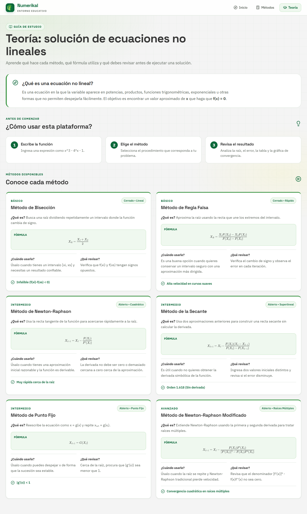
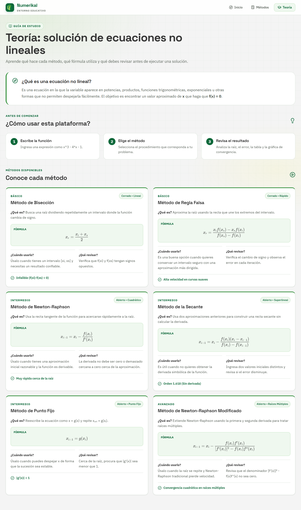
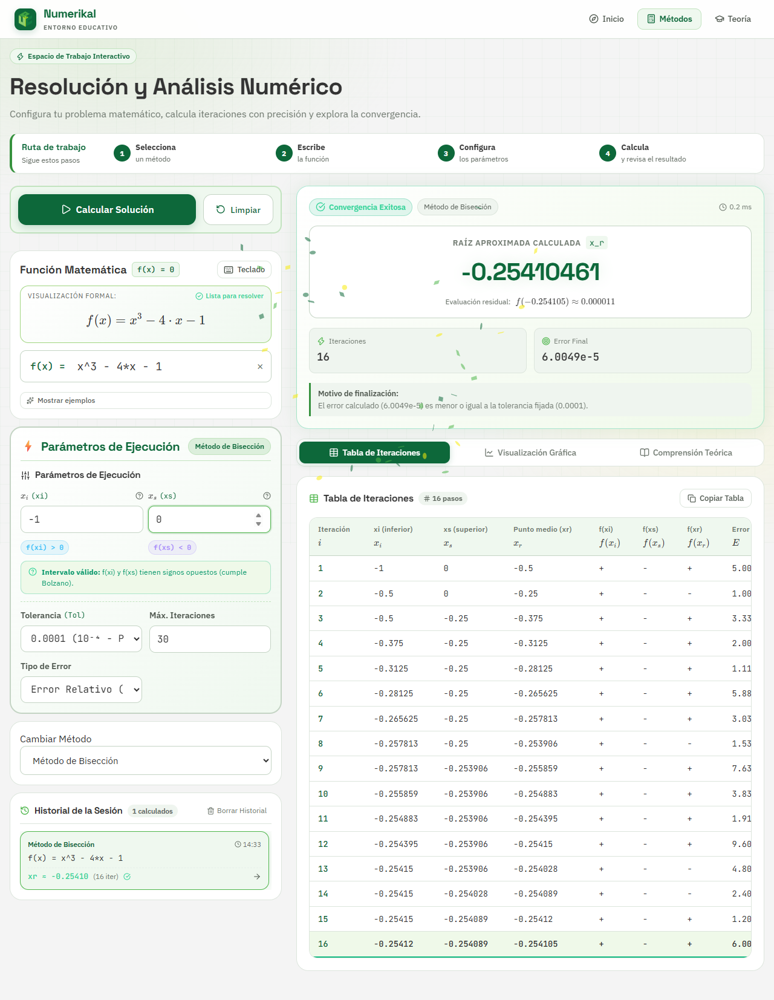

# Reporte de trabajo — 29/09/2026

**Proyecto:** Numerikal — Proyecto de Aula de Análisis Numérico
**Repositorio:** [mtocora26/Numerikal](https://github.com/mtocora26/Numerikal)

## Resumen

| Issue | Título | Estado | Rama |
|---|---|---|---|
| [#5](https://github.com/mtocora26/Numerikal/issues/5) | Textos académicos de la página de inicio | Terminado, pendiente de fusionar | `5-update-homepage-academic-text` |
| [#6](https://github.com/mtocora26/Numerikal/issues/6) | Letras minúsculas en las fórmulas de teoría | Terminado, pendiente de fusionar | `6-improve-lowercase-notation-in-theory-formulas` |
| [#10](https://github.com/mtocora26/Numerikal/issues/10) | Intervalo por defecto de los métodos cerrados | Issue nuevo, sin empezar | — |

Cada issue se trabajó en su propia rama, creada con `gh issue develop` para que quede vinculada al issue en GitHub (sección *Development*). Los commits incluyen `Closes #N`, así que el issue se cierra solo al fusionar la rama con `main`.

---

## Issue #5 — Textos académicos de la página de inicio

**Commit:** `4606d75`

| Ubicación | Antes | Después |
|---|---|---|
| Encabezado institucional | Proyecto académico | Proyecto de Aula |
| Título del encabezado | Análisis numérico | Análisis Numérico |
| Título de la portada | Métodos numéricos | Métodos Numéricos |
| Título de la página de teoría | Teoría: solución de ecuaciones no lineales | Solución de Ecuaciones No Lineales |

La pestaña **Teoría** del menú de navegación se mantiene, porque es el nombre de la sección.

**Archivos:** `src/pages/Home/Home.tsx`, `src/pages/Learn/Learn.tsx`

---

## Issue #6 — Letras minúsculas en las fórmulas de teoría

**Commit:** `eb61b84`

### Problema

En la página de teoría **todas** las fórmulas aparecían en mayúsculas: `X_R = (X_I + X_S)/2`, `F(X_I)`, `G(X_I)`, etc. En la tabla de iteraciones, los encabezados también se veían como `F(XI)` y `XI (INFERIOR)`.

### Causa

Las fórmulas en LaTeX estaban bien escritas en minúscula. El error venía de una regla de estilos (CSS) pensada solo para la etiqueta "FÓRMULA":

```css
.method-formula > span { text-transform: uppercase; }
```

La fórmula también se muestra dentro de un `<span>` que es hijo directo del mismo contenedor, así que la regla la afectaba y convertía todas sus letras a mayúscula.

### Solución

1. La etiqueta "Fórmula" recibió una clase propia (`method-formula-label`) y la regla de mayúsculas se aplica solo a esa clase.
2. Se quitó la transformación a mayúsculas de los encabezados de la tabla de iteraciones, porque contienen variables como `f(xi)`, donde mayúscula y minúscula no significan lo mismo.

No se modificó ninguna fórmula; solo cambió la forma de mostrarlas.

**Archivos:** `src/pages/Learn/Learn.tsx`, `src/pages/Learn/Learn.css`, `src/components/IterationTable/IterationTable.css`

### Verificación

Se tomaron capturas de la aplicación en ejecución antes y después del cambio.

**Página de teoría — antes** (fórmulas en mayúscula):



**Página de teoría — después** (notación correcta en minúscula):



**Tabla de iteraciones — después** (encabezados `xi`, `f(xi)` en minúscula):



> Las capturas de la rama #6 todavía muestran el título "Teoría: …", porque ese cambio está en la rama del #5. Al fusionar las dos ramas se verán ambos cambios.

---

## Issue nuevo #10 — Intervalo por defecto de los métodos cerrados

Encontrado durante la verificación del #6. La función de ejemplo es `x^3 - 4*x - 1`, pero Bisección y Regla Falsa proponen por defecto el intervalo `[1, 2]`, donde `f(1) = -4` y `f(2) = -1` tienen el mismo signo. Al pulsar **Calcular Solución** sin cambiar nada aparece un error de validación. Se propone usar `[2, 3]`.

---

## Comprobaciones

- `npm run build`: compila sin errores en las dos ramas.
- `npm run lint`: sin avisos nuevos. Siguen dos avisos que ya existían en `Calculator.tsx` (`set-state-in-effect`).

## Pendiente

1. Abrir los Pull Requests de las ramas #5 y #6 hacia `main` y fusionarlos.
2. Próximos issues sugeridos: #10 (rápido), luego #2 (README) y #1 (organización del código), que pueden resolverse juntos.
